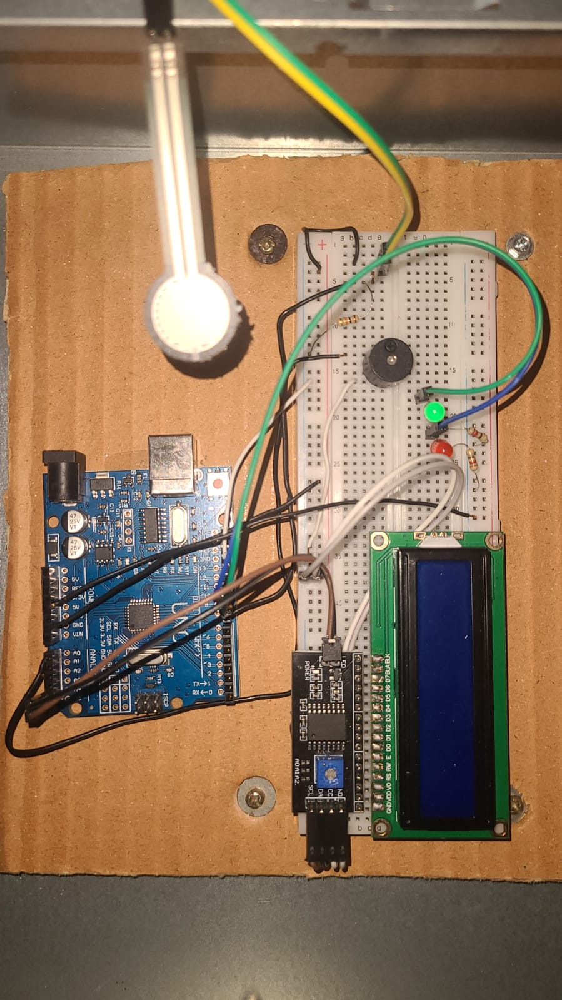

# 🫀 Arduino CPR Feedback Training Module

A low-cost, real-time feedback system designed to gamify and digitize CPR training. This device upgrades standard passive manikins into "smart" training tools compliant with **AHA 2025 Guidelines**.

## 🎥 Project Demo

## 💡 The Problem
High-fidelity CPR manikins that provide feedback on compression depth and rate cost thousands of dollars, making quality training inaccessible in many regions.

## 🛠️ The Solution
I developed a portable, non-invasive module using an **Arduino Uno** and **Force Sensitive Resistors (FSR)** to measure compression quality. The system provides:
- **Visual Feedback:** 16x2 LCD & LEDs (Green = Good Depth, Red = Poor Depth).
- **Auditory Guidance:** Active buzzer metronome at **110 BPM**.
- **Cycle Management:** Automates the 30:2 compression-to-breath cycle.
- **Power Saving:** Auto-sleep mode after 2 minutes of inactivity.

## 🔌 Hardware Tech Stack
- **Microcontroller:** Arduino Uno (ATmega328P)
- **Sensors:** Interlink FSR 402 (Calibrated for 5-6cm depth proxy)
- **Display:** 16x2 LCD with I2C Interface (PCF8574)
- **Feedback:** 5mm LEDs (Green, Red, Blue) & Active Buzzer

## 💻 Code Highlights
The firmware is written in **C++** and utilizes a **Non-Blocking State Machine** architecture.
- Replaced standard `delay()` with `millis()` timers to allow simultaneous sensor reading and metronome beeping.
- Implemented noise filtering and hysteresis to prevent LED flickering during compressions.

## 🚀 How to Run
1. Install the `LiquidCrystal_I2C` library in Arduino IDE.
2. Connect the FSR sensor to Pin A0 (with 10kΩ pull-down resistor).
3. Connect LCD via I2C (SDA -> A4, SCL -> A5).
4. Upload `CPR_Trainer.ino`.

---
Made by: Muhammad Sohair Khan
Led by: Engr. M. Yasir Zaheen

**University:** Sir Syed University of Engineering & Technology (SSUET).
